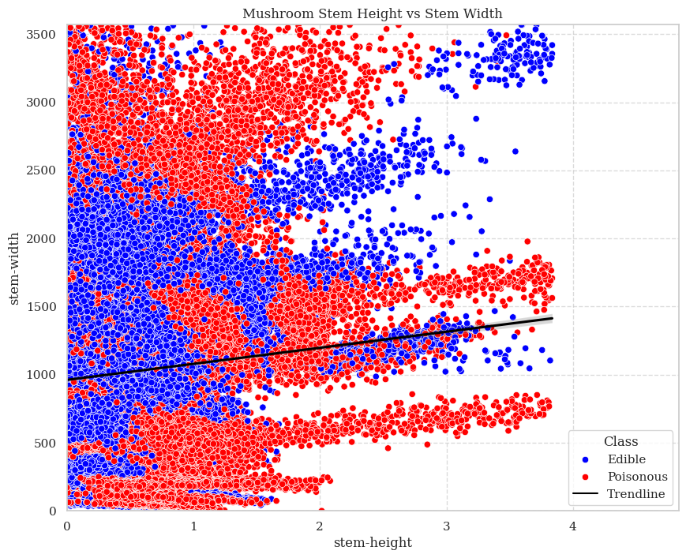

# Mushroom Classification

This project focuses on developing a binary classification model to accurately predict whether a mushroom is edible or poisonous based on a given dataset. The dataset, a cleaned version of the original Mushroom Dataset from UCI, includes features such as cap diameter, cap shape, gill attachment, gill color, and others. The goal is to create a reliable model that can assist in identifying potentially harmful mushrooms.

## Usage

Firstly, clone the repository using the following command:

```bash
git clone https://gitlab.com/imrobintomar/mushroom-classification.git
```

Navigate to the project directory:

```bash
cd mushroom-classification
```

Install the required dependencies using the following command:

```bash
pip install -r requirements.txt
```

Run the standalone application to predict the class of a mushroom based on its features:

```bash
python main.py
```

The application will prompt you to enter the features of the mushroom, such as cap diameter, cap shape, gill attachment, gill color, and others. Once you have entered the features, the application will predict whether the mushroom is edible or poisonous.

### Example Usage

Here is an example of using the standalone application to predict the class of a mushroom based on its features:

```bash
[?] Enter cap diameter (cm): 550
[?] Enter cap shape (0-6): 4
[?] Enter gill attachment (0-6): 2
[?] Enter gill color (0-11): 10
[?] Enter stem height (cm): 0.5486747819303103
[?] Enter stem width (cm): 1220
[?] Enter stem color (0-12): 11
[?] Enter season (0 - Early Season, 1 - Late Season, 1.75 - All Season): 1
```

The application will then display the predicted class of the mushroom:

```bash
[+] Predicted class: Poisonous
```

NOTE: Due to limited information about the season, I've assigned the following values: *0* for early season, *1* for late season, and *1.75* for all seasons.

## Introduction

Mushrooms are a popular food choice for many people around the world. However, not all mushrooms are safe to eat. Some species of mushrooms are poisonous and can cause serious health problems or even death if consumed. Therefore, it is important to be able to accurately identify which mushrooms are safe to eat and which ones are not. 

## Project Goal

The goal of this project is to create a reliable binary classification model that can accurately predict whether a mushroom is edible or poisonous based on a given dataset. The model will be trained on a cleaned version of the Mushroom Dataset from UCI, which includes various features such as cap diameter, cap shape, gill attachment, gill color, and others. The model will be evaluated based on its accuracy, precision, recall, and F1 score.

## The Data

The dataset used in this project is a cleaned version of the original Mushroom Dataset from UCI. The dataset contains 22 features and 1 target variable, with a total of 54,035 instances. The target variable is the class of the mushroom (edible or poisonous), while the features include various attributes such as cap diameter, cap shape, gill attachment, gill color, and others.

### Dataset Snapshot

The following table shows a snapshot of the dataset used in this project:

- `cap-diameter`: The diameter of the mushroom cap in centimeters.
- `cap-shape`: The shape of the mushroom cap (0=convex, 1=flat, 2=knobbed, 3=bell, 4=sunken, 5=conical, 6=convex).
- `gill-attachment`: The attachment of the gill to the stem (0=free, 1=attached, 2=descending, 3=notched, 4=collar, 5=free, 6=adnate).
- `gill-color`: The color of the gill (0=white, 1=brown, 2=black, 3=pink, 4=gray, 5=red, 6=yellow, 7=orange, 8=buff, 9=green, 10=purple, 11=blue).
- `stem-height`: The height of the mushroom stem in centimeters.
- `stem-width`: The width of the mushroom stem in centimeters.
- `stem-color`: The color of the mushroom stem (0=white, 1=brown, 2=black, 3=pink, 4=gray, 5=red, 6=yellow, 7=orange, 8=buff, 9=green, 10=purple, 11=blue).
- `season`: The season in which the mushroom was found.
- `class`: The class of the mushroom (1=edible, 0=poisonous).

## Methodology

- **Data Preprocessing**: The dataset is preprocessed by encoding categorical variables, splitting the data into training and testing sets, and scaling the features.
- **Model Development**: Several classification models are trained on the training data, including K-Nearest Neighbors, Support Vector Machine, Logistic Regression, and XGBoost.
- **Model Evaluation**: The models are evaluated based on their accuracy, precision, recall, and F1 score using the testing data.
- **Model Selection**: The best-performing model is selected based on the evaluation metrics and is used to make predictions on new data.
- **Model Deployment**: The selected model is deployed as a standalone application that can be used to predict the class of a mushroom based on its features.

## Tools

This project is implemented using Python and the following tools and libraries such as **NumPy**, **Pandas**, **Scikit-learn**, **Matplotlib**, **SeaBorn**, and **XGBoost**.

## Visualizations

### Mushroom Cap Diameter vs Stem Height

The following scatter plot shows the relationship between the cap diameter and stem height of the mushrooms in the dataset. The plot illustrates how the cap diameter and stem height are distributed among the mushrooms, with different colors representing the class of the mushrooms (edible or poisonous).


> While cap diameter and stem height can provide some clues to differentiate between edible and poisonous mushrooms, these features alone are not foolproof. There's a degree of overlap between the two groups, suggesting that other factors also play a role. A slight positive correlation exists between cap diameter and stem height, indicating that larger mushrooms might generally have taller stems. However, it's important to note that simply identifying mushrooms based on size alone can be risky, as there's no guarantee that larger mushrooms are always edible.

### Mushroom Cap Diameter vs Stem Width

The following scatter plot shows the relationship between the cap diameter and stem width of the mushrooms in the dataset. The plot illustrates how the cap diameter and stem width are distributed among the mushrooms, with different colors representing the class of the mushrooms (edible or poisonous).


> It shows a clear positive correlation between cap diameter and stem height. However, there is also a significant overlap between edible and poisonous mushrooms, indicating that these two features alone are not sufficient to accurately classify mushroom edibility. The trendline suggests a general linear relationship between the two variables, but there are a number of outliers that deviate from this trend. Overall, while cap diameter and stem height can provide some insights into mushroom characteristics, they are not the sole determinants of edibility.

### Mushroom Stem Height vs Stem Width

The following scatter plot shows the relationship between the stem height and stem width of the mushrooms in the dataset. The plot illustrates how the stem height and stem width are distributed among the mushrooms, with different colors representing the class of the mushrooms (edible or poisonous).



> It shows a weak positive correlation between stem height and stem width. There is a clear overlap between edible and poisonous mushrooms, indicating that these two features alone are not sufficient to accurately classify mushroom edibility. The trendline suggests a slight linear relationship between the two variables, but there are a number of outliers that deviate from this trend. Overall, while stem height and stem width can provide some insights into mushroom characteristics, they are not the sole determinants of edibility.

## Model Evaluation

The following table shows the evaluation metrics for the classification models trained on the Mushroom Dataset:

| Model Name | Model File | Accuracy | Precision | Recall | F1 Score |
|-------|------------|----------|-----------|--------|----------|
| K-Nearest Neighbors | [knn.py](/src/training/knn.py) | 0.73 | 0.73 | 0.73 | 0.73 |
| XGBoost | [xgboost.py](/src/training/xgboost.py) | 0.95 | 0.95 | 0.95 | 0.95 |
| **(Fine-Tuned) XGBoost** | **[tuning/xgboost.py](/src/tuning/xgboost.py)** | **0.99** | **0.99** | **0.99** | **0.99** |
| Logistic Regression | [lgr.py](/src/training/lgr.py) | 0.64 | 0.64 | 0.64 | 0.63 |
| Support Vector Machine | [svm.py](/src/training/svm.py) | 0.65 | 0.65 | 0.65 | 0.65 |

### Model Performance Comparison

The following plots show the learning curves of the models, illustrating the training and cross-validation scores over different values of hyperparameters or epochs. This helps in understanding how the choice of hyperparameters affects the model's performance on both training and testing datasets:

| Model | Graph |
|-------|-------|
| K-Nearest Neighbors |  |
| XGBoost |  |
| **(Fine-Tuned) XGBoost** |  |
| Logistic Regression |  |
| Support Vector Machine |  |

For each model, the plots illustrate the training and cross-validation accuracy and loss (if applicable) over different hyperparameter values or epochs. This visualization aids in selecting the best model and hyperparameters for the Mushroom Dataset classification task.


## Conclusion

In this project, we developed a binary classification model to predict whether a mushroom is edible or poisonous based on a given dataset. The best-performing model was the fine-tuned XGBoost model, which achieved an accuracy of 0.99, precision of 0.99, recall of 0.99, and F1 score of 0.99. The model can be used to identify potentially harmful mushrooms and assist in making informed decisions about whether to consume them.